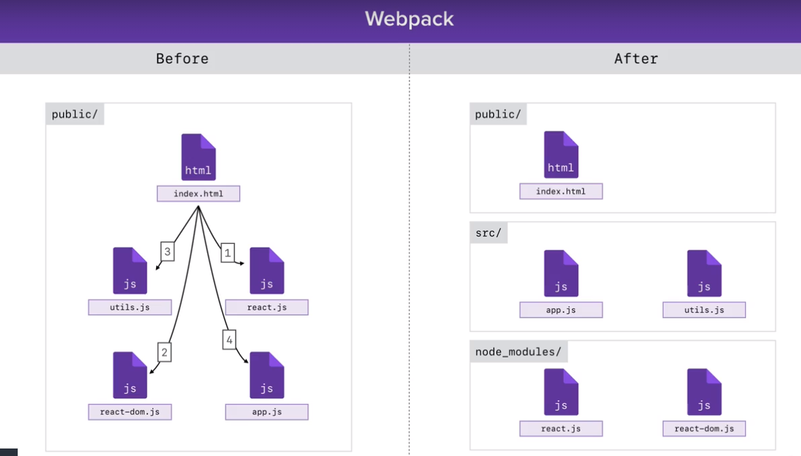

# Webpack 



## Note on importing and exporting certain functions
If you import a default function exports, you can change its name to whatever you like. On the other hand, the name must remain the same for import named exports. 
Example:
```javascript
//file 1
export { square, add, subtract as default }
//file 2
import subtract, { square, add } from './utils.js'
```
The subtract import can be changed to whatever name you would like

## Loader
A lodaer lets you customise the behaviour of webpack when it loads a file. We use babel to load a file